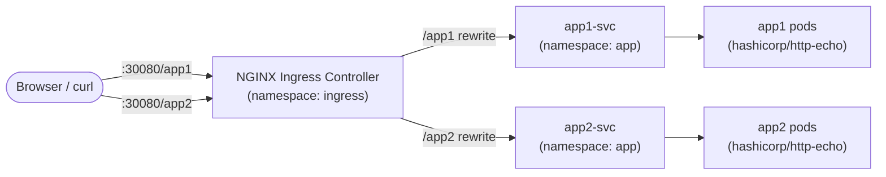

# K3s Path-Based Ingress Routing Demo

A hands-on Kubernetes learning project: two simple web apps (`app-01`, `app-02`) deployed on a **k3s** cluster and exposed through **path-based routing** using the **NGINX Ingress Controller**, running alongside k3s's default **Traefik** controller.

- `http://<K3S_SERVER_IP>:30080/app-01` → `hello world my name APP-01`
- `http://<K3S_SERVER_IP>:30080/app-02` → `hello world my name APP-02`

## Overview

This project demonstrates:
- Writing Kubernetes **Deployments** and **Services**
- Organizing resources with **Namespaces**
- Installing a **secondary Ingress controller** (NGINX) via Helm without disabling k3s's built-in Traefik
- **Path-based routing** with a single `Ingress` resource using regex path capture + rewrite rules
- Testing services both **in-cluster** (`kubectl run`) and **externally** (curl / browser)

## Architecture



**Why NodePort instead of port 80/443?**
k3s ships with Traefik as its default ingress controller, already bound to the host's ports 80/443 via k3s's built-in ServiceLB. Rather than disabling Traefik, this project installs NGINX Ingress as a **NodePort** service on `30080`/`30443`, so both controllers can coexist.

## Project Structure

```
.
├── app1.yaml     # Deployment + Service for App1
├── app2.yaml     # Deployment + Service for App2
├── ingress.yaml  # Ingress resource — path-based routing to app1-svc / app2-svc
└── README.md
```

## Prerequisites

- A running [k3s](https://k3s.io/) cluster
- `kubectl` configured against the cluster
- [Helm 3](https://helm.sh/)

## Setup

### 1. Create namespaces

```bash
kubectl create namespace app
kubectl create namespace ingress
```

### 2. Deploy the apps

```bash
kubectl apply -f app1.yaml
kubectl apply -f app2.yaml
kubectl get pods -n app
```

### 3. Install the NGINX Ingress Controller (NodePort, Traefik untouched)

```bash
helm repo add ingress-nginx https://kubernetes.github.io/ingress-nginx
helm repo update

helm install ingress-nginx ingress-nginx/ingress-nginx \
  --namespace ingress \
  --set controller.service.type=NodePort \
  --set controller.service.nodePorts.http=30080 \
  --set controller.service.nodePorts.https=30443

kubectl get pods -n ingress
kubectl get svc -n ingress
```

### 4. Apply the Ingress rules

```bash
kubectl apply -f ingress.yaml
kubectl get ingress -n app
```

## Testing

**In-cluster (internal):**

```bash
kubectl run curl-test --image=curlimages/curl --rm -it --restart=Never -n app -- curl -s http://app1-svc
kubectl run curl-test2 --image=curlimages/curl --rm -it --restart=Never -n app -- curl -s http://app2-svc
```

**External (via NGINX Ingress NodePort):**

```bash
curl http://<K3S_SERVER_IP>:30080/app1
curl http://<K3S_SERVER_IP>:30080/app2
```

**Browser:**

```
http://<K3S_SERVER_IP>:30080/app1
http://<K3S_SERVER_IP>:30080/app2
```

Expected results:

| Path    | Response                        |
|---------|----------------------------------|
| `/app1` | `hello world my name APP-01`    |
| `/app2` | `hello world my name APP-02`    |

## Cleanup

```bash
kubectl delete -f ingress.yaml
kubectl delete -f app1.yaml
kubectl delete -f app2.yaml
helm uninstall ingress-nginx -n ingress
kubectl delete namespace app ingress
```

## What I Learned

- Core Deployment / Service / Namespace objects
- Running a second Ingress controller alongside k3s's default Traefik without conflicts
- How `Ingress` path matching, `pathType`, and the `nginx.ingress.kubernetes.io/rewrite-target` annotation work together
- Verifying service reachability from inside the cluster with `kubectl run --rm -it`

## License

MIT
